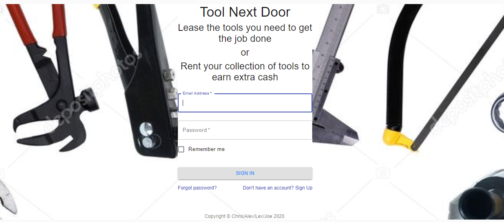
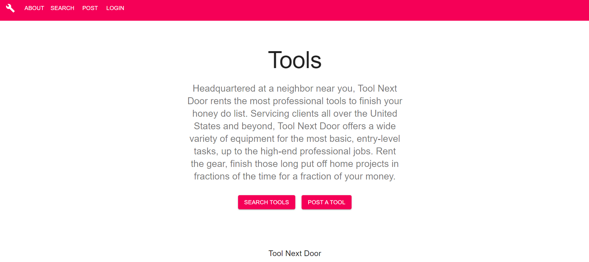
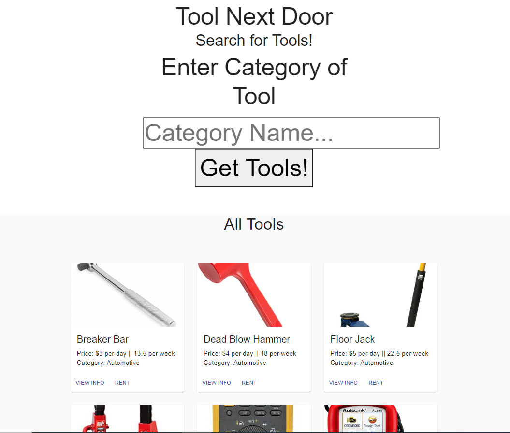
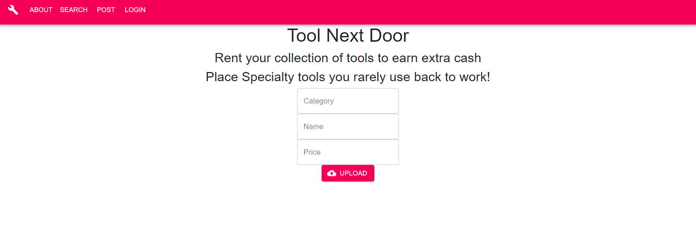
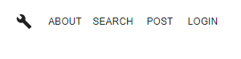

# ToolNextDoor
A TOOLution to your equipment needs

# Table of Contents
* [Description](#description)
* [User_Story](#user_story)
* [Images](#images)
* [Links](#links)
* [Technology_Used](#technology_used)
* [Contributors](#contributors)

# Description

Tool Next Door is a community of do-it-yourselfers that benefit from each other needs. 

Users: Need tools or equipment that they don’t own because of price or 
frequency of use, or don’t have the storage space for because of living situation.

Renters: Have a collection of tools and/or equipment to rent out for a price and amount of time that they set.

# User_Story

When there's a list of projects to be done, and you don't have the tools you need, Tool Next Door allows you to find the right equipment for the job without having to buy the tool forever or requiring the space to store it. 

Tool Next Door also allows your tools to make money for you if you area contractor, a tool collector, or 
just have a garage full of equipment that sits around gathering dust and rust, you can list them on Tool Next Door for people to rent. 

# Images
When you arrive at Tool Next Door, you can sign-in to the app

 
 

A quick over of the app, then you have the choice of finding a tool to rent, or making your equipment available to others

 
 

A selction of tools in the search field

 
 

the input boxes for listing your tools to rent out

 
 

a search menu to help you navigate the app

 
 

A tool that has been selected that gives you the image of the tool, price and the owner

 
 

# Links

GitHub - 

Heroku -

# Technology_Used

Heroku

JAWSdb

React

Stripe

JavaScript

Node

Material-UI

GitHub

HTML/CSS

# Contributors
Chris Ferguson [@cfergus7](https://github.com/cfergus7)

Alex Taggert [@AlexTagg392](https://github.com/AlexTagg392)

Lex Pryor [@LexTheMenace](https://github.com/LexTheMenace)

Joe Wills [@JoeWills615](https://github.com/JoeWills615)

